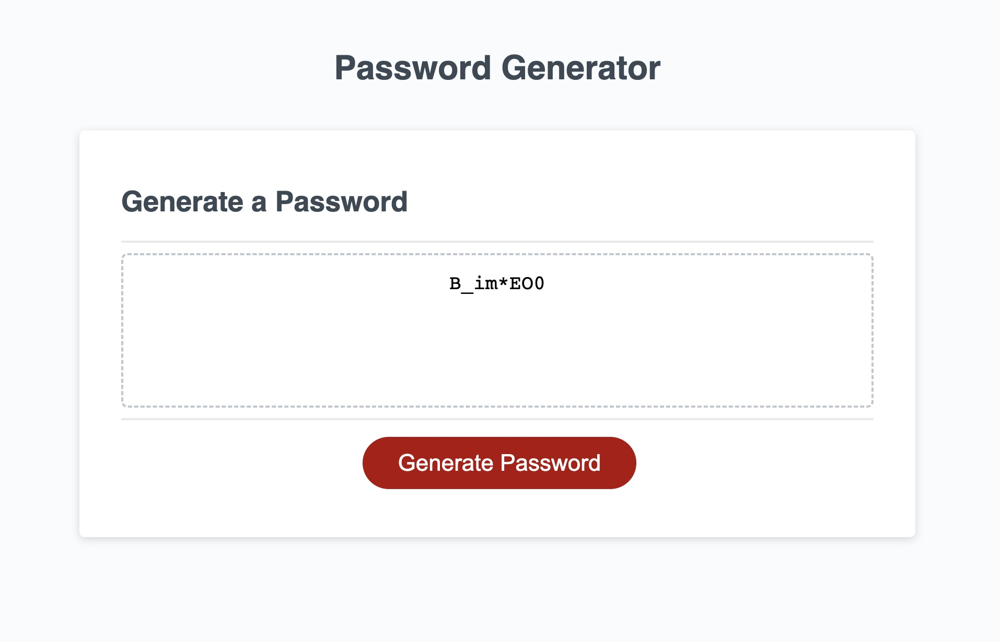

# Homework 03 - Password Generator

## Description

For this assignment, I was tasked with finishing the JavaScript code for a radom password generator which could be customized with parameters as to the password's length and which letters, numbers, and special characters can be used in the password's generation. 

## Installation

N/A

## Usage

The user will be presented with a webpage featuring a prominent red button labeled "Generate Password." Once clicked, a series of prompts begin. First the user will input a numberical value from 8-128, determining the length of the password. Next, the user will be asked if they would like to include lowercase letters, uppercase letters, special characters, and finally numbers in the password. Once all the choices have an answer, the user will be presnted with a password inside the dotted box that conforms to their selections.

## Credits

I must thank Paul Keldsen and his YouTube video for walking me through the initial steps of the assignment, explaining exactly what I was doing, and pointing me in the right direction for my research. Next, thanks to W3 Schools and Mozilla Development Network for asnwering my questions and allowing me to search for the missing pieces. Finally, big ups to our TA Shawn and my fellow students for being there when needed. 

## License

Please refer to the LICENSE in the repository.

## Deloyed

Github: https://github.com/JasperJackalope/homework03-password-generator

Website: https://jasperjackalope.github.io/homework03-password-generator/